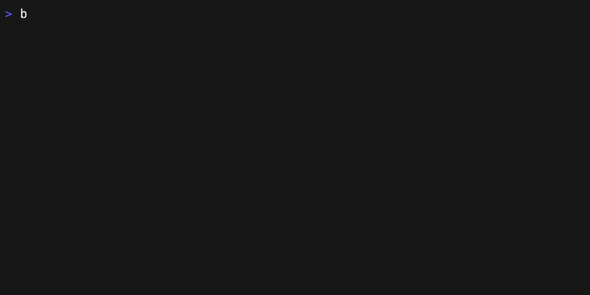

# bk - The Buildkite CLI

[](https://github.com/buildkite/cli/releases)

A command line interface for [Buildkite](https://buildkite.com/).

Use `bk` to interact with your Buildkite organization without leaving the terminal 🙌.



## Installing

### Using the binary

`bk` is available as a downloadable binary from the [releases page](https://github.com/buildkite/cli/releases).

### Using Brew

```sh
brew tap buildkite/buildkite && brew install buildkite/buildkite/bk
```

## Usage

```
Usage: bk <command> [flags]

The official Buildkite CLI

Flags:
  -h, --help       Show context-sensitive help.
  -V, --verbose    Enable verbose error output

Commands:
  agent list [flags]
    List agents

  agent stop <agents> ... [flags]
    Stop agents

  agent view <agent> [flags]
    View agent details

  api <path> [flags]
    Make raw API requests to Buildkite REST API

  artifacts list <build> [flags]
    List build artifacts

  artifacts download <build> [flags]
    Download artifacts

  build cancel <build>
    Cancel a build

  build download <build> [flags]
    Download build artifacts or job logs

  build new [<pipeline>] [flags]
    Create a build

  build rebuild <build>
    Rebuild a build

  build view [<build>] [flags]
    View a build

  build watch <build> [flags]
    Watch build status until completion

  cluster list [flags]
    List clusters

  cluster view <cluster> [flags]
    View cluster details

  configure main [flags]
    Configure authentication credentials and API tokens

  configure add [flags]
    Add configuration for additional organization

  init [flags]
    Create .buildkite/pipeline.yml with a basic build step interactively

  job logs <job>
    View job logs

  job retry <job>
    Retry a job

  job unblock <job> [flags]
    Unblock a job

  pipeline create [flags]
    Create a pipeline

  pipeline view <pipeline> [flags]
    View pipeline details

  pipeline validate [flags]
    Validate pipeline configuration

  package (pkg) push <registry> <file> [flags]
    Push package to registry

  prompt [flags]
    Generate shell prompt integration to display current Buildkite organization.

  use <organization> [flags]
    Switch between different Buildkite organizations

  user invite <emails> ... [flags]
    Invite users to your Buildkite organization via email

  version [flags]
    Show CLI version information

  whoami [flags]
    Print the current user and organization

  help [<commands> ...] [flags]
    Show detailed help for commands and subcommands

  install-completions [flags]
    Install shell tab completion for bash, zsh, fish, or powershell

Run "bk <command> --help" for more information on a command.
```

### Configure

You'll need to run `bk configure` first to set up your organization and API token.

### Shell Prompt Integration

Want to display your current Buildkite organization in your shell prompt? Check out our [Shell Prompt Integration Guide](/docs/shell-prompt-integration.md) for detailed instructions for Zsh, Bash, and Powerlevel10k.

## 💬 Feedback

We'd love to hear any feedback and questions you might have. Please [file an issue on GitHub](https://github.com/buildkite/cli/issues) and let us know!

## 🔨 Development

Developed using Golang 1.20+ with modules.

```bash
git clone git@github.com:buildkite/cli.git
cd cli/
export BUILDKITE_GRAPHQL_TOKEN="<token>"
go generate
go run cmd/bk/main.go --help
```
