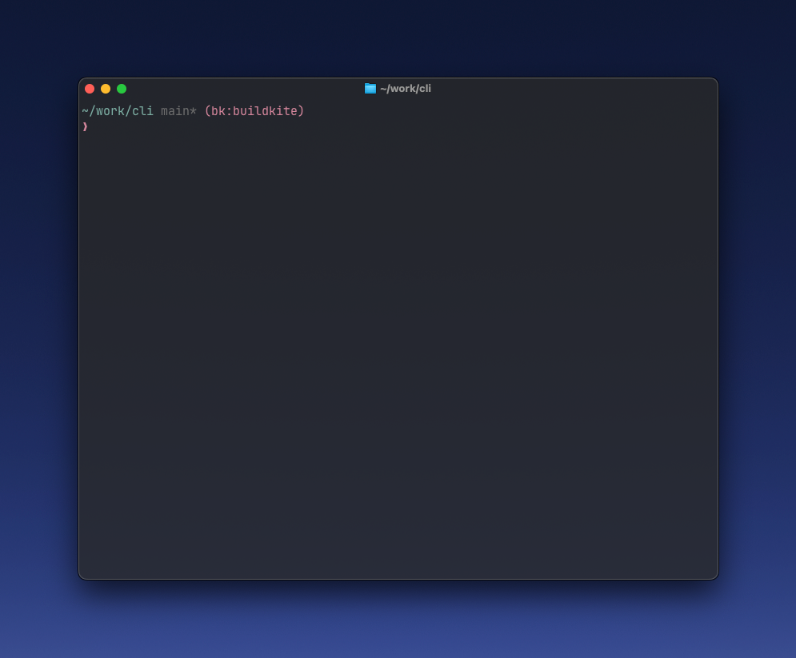

### Shell Prompt Integration

The Buildkite CLI offers a shell prompt integration that displays your current Buildkite organization directly in your prompt.



#### Zsh (Vanilla)

1. Create a prompt function in `~/.buildkite/zsh_prompt.zsh`:

```zsh
_buildkite_ps1() {
    local org=$(bk use 2>&1 | grep "Using configuration for" | sed -E "s/Using configuration for \`(.*)\`/\1/")
    if [[ -n "$org" ]]; then
        echo -n " (bk:$org)"
    fi
}

# Modify your existing prompt to include the Buildkite organization
PROMPT='%n@%m %1~$(_buildkite_ps1)%# '
```

2. Source the script in your `.zshrc`:

```zsh
source $HOME/.buildkite/zsh_prompt.zsh
```

#### Zsh (Powerlevel10k)

1. Add the following function to `~/.buildkite/zsh_prompt.zsh`:

```zsh
_buildkite_ps1() {
    # Cache the prompt output for 5 seconds to avoid running bk too frequently
    if [[ -z "$BK_PROMPT_CACHE" ]] || [[ $(($EPOCHSECONDS % 5)) -eq 0 ]]; then
        local org=$(bk use 2>&1 | grep "Using configuration for" | sed -E "s/Using configuration for \`(.*)\`/\1/")
        if [[ -n "$org" ]]; then
            BK_PROMPT_CACHE="%F{magenta}(bk:$org)%f"
        else
            BK_PROMPT_CACHE="%F{yellow}(bk:not configured)%f"
        fi
    fi
    echo -n "$BK_PROMPT_CACHE"
}

# Wrap the bk command to clear prompt cache when switching orgs
bk() {
    command bk "$@"
    if [[ "$1" == "use" ]]; then
        unset BK_PROMPT_CACHE
    fi
}
```

2. Source this script in your `.zshrc`:

```zsh
source $HOME/.buildkite/zsh_prompt.zsh
```

3. Add the Buildkite organization to your prompt elements in `~/.p10k.zsh`:

```zsh
typeset -g POWERLEVEL9K_LEFT_PROMPT_ELEMENTS=(
  # ... other existing elements
  buildkite_org
)
```

#### Bash

1. Create a prompt function in `~/.buildkite/bash_prompt.sh`:

```bash
_buildkite_ps1() {
    local org=$(bk use 2>&1 | grep "Using configuration for" | sed -E "s/Using configuration for \`(.*)\`/\1/")
    if [[ -n "$org" ]]; then
        echo -n " (bk:$org)"
    fi
}

# Modify your PS1 to include the Buildkite organization
export PS1='\u@\h \w$(_buildkite_ps1)\$ '
```

2. Source the script in your `.bashrc`:

```bash
source $HOME/.buildkite/bash_prompt.sh
```

#### Features

- Displays current Buildkite organization in your shell prompt
- Caches organization info to minimize performance impact
- Works across different projects and directories
- Supports quick organization switching with `bk use`

#### Troubleshooting

- Ensure you've run `bk configure` to set up your organization
- Verify the `.bk.yaml` in your project's root directory
- Check that you're using a locally built `bk` binary in development projects

#### Performance Considerations

The prompt integration uses a lightweight method to retrieve the current organization. However, to minimize any potential performance impact:
- The script caches the organization name
- The command is only run periodically or when switching organizations
- You can customize the caching mechanism if needed
